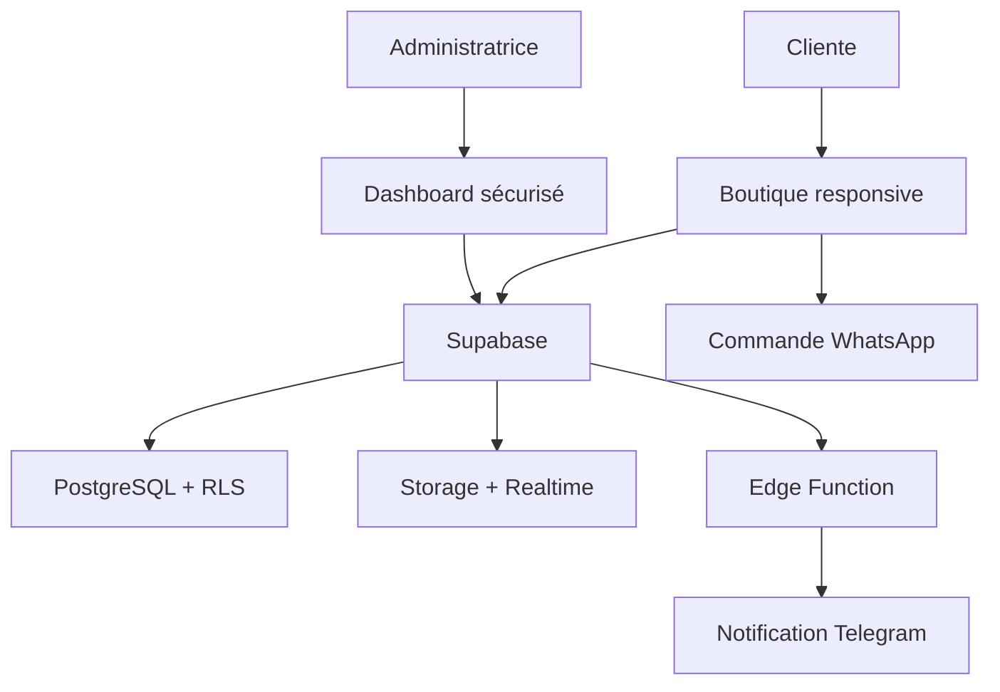

<div align="center">
  

  # NARI'S WEAR

  **Une boutique digitale élégante, pensée pour la femme algérienne.**

  Prêt-à-porter féminin · Alger · Livraison dans les 58 wilayas

  [](#stack-technique)
  [](#architecture)
  [](#déploiement)
  [](./LICENSE)

  [Voir la boutique](https://nari-s-wear-online-boutique.onrender.com) ·
  [Instagram](https://www.instagram.com/naris_wear) ·
  [Administration](https://nari-s-wear-online-boutique.onrender.com/admin/)
</div>


## L’expérience NARI'S WEAR

NARI'S WEAR est une expérience e-commerce sur mesure pour une boutique de mode
féminine basée à Alger. Le projet associe une identité visuelle premium à un
parcours d’achat adapté au marché algérien : catalogue dynamique, choix des
variantes, paiement à la livraison, calcul des frais par wilaya et confirmation
directe sur WhatsApp.

Le site fonctionne sans framework ni étape de compilation. Supabase fournit la
base de données, l’authentification, le stockage des images, le temps réel et
les fonctions backend.

## Fonctionnalités

### Pour les clientes

- Catalogue dynamique avec recherche, tri et filtres par catégorie, couleur,
  taille, disponibilité et prix.
- Fiches produit avec galerie, variantes de couleur, tailles et stock.
- Favoris et panier persistants dans le navigateur.
- Recommandations « Les clientes ont aussi aimé ».
- Badges nouveautés, best-sellers et stock limité.
- Codes promotionnels et calcul du total estimé.
- Livraison Yalidine avec tarification par wilaya.
- Commande préparée et confirmée sur WhatsApp.
- Avis clients avec photos et validation avant publication.
- Conseillère taille & style et Live Chat.
- Newsletter et galerie Instagram.
- Interface responsive, mode clair/sombre et français/arabe avec RTL.
- Carte Google Maps, FAQ et informations pratiques.

### Pour l’administration

- Authentification Supabase et contrôle d’accès par administrateur autorisé.
- Gestion des produits, catégories, variantes, images et stocks.
- Suivi des commandes et changement de statut.
- Modération des avis clients.
- Création et activation des codes promotionnels.
- Boîte de réception Live Chat en temps réel.
- Notifications navigateur pour les commandes et messages.
- Notifications Telegram via Supabase Edge Function.
- Tableau de bord et suivi Google Analytics / Tag Manager.

## Architecture



## Stack technique

| Couche | Technologies |
|---|---|
| Interface | HTML5, CSS3, JavaScript moderne |
| Données | Supabase PostgreSQL |
| Sécurité | Supabase Auth, Row Level Security |
| Médias | Supabase Storage |
| Temps réel | Supabase Realtime |
| Backend | Supabase Edge Functions / Deno |
| Commandes | WhatsApp |
| Notifications | Web Notifications, Telegram |
| Mesure | Google Analytics, Google Tag Manager |
| Hébergement | Render |

## Démarrage rapide

Ce projet ne nécessite ni `npm install` ni compilation.

1. Téléchargez ou clonez le dépôt.
2. Ouvrez `index.html` avec un serveur local.
3. Renseignez votre projet Supabase dans `config.js`.
4. Configurez la base de données avec les migrations ci-dessous.

Exemple de serveur local :

```bash
python3 -m http.server 8080
```

Puis ouvrez `http://localhost:8080`.

## Configuration Supabase

### 1. Configuration publique

`config.js` doit contenir uniquement des informations prévues pour le
navigateur :

```js
window.NARIS_CONFIG = {
  supabaseUrl: "https://YOUR_PROJECT.supabase.co",
  supabaseAnonKey: "YOUR_PUBLISHABLE_OR_ANON_KEY",
  whatsapp: "213XXXXXXXXX"
};
```

> N’utilisez jamais une clé `service_role`, `sb_secret_...`, un token Telegram
> ou un mot de passe dans `config.js`.

### 2. Migrations

Exécutez les fichiers dans **Supabase → SQL Editor**, dans cet ordre :

1. `supabase-setup.sql`
2. `supabase-admin-policies.sql`
3. `product-variants-migration.sql`
4. `customer-experience-migration.sql`
5. `LIVE-CHAT-MIGRATION.sql`

Avant la deuxième étape, créez le compte administrateur dans Supabase
Authentication puis remplacez `YOUR_ADMIN_EMAIL@example.com` par son adresse
exacte dans `supabase-admin-policies.sql`.

### 3. Notifications Telegram

La fonction `notify-live-chat` lit les secrets suivants :

```text
TELEGRAM_BOT_TOKEN
TELEGRAM_CHAT_ID
ADMIN_LIVE_CHAT_URL
```

Déploiement avec Supabase CLI :

```bash
supabase functions deploy notify-live-chat
supabase secrets set TELEGRAM_BOT_TOKEN="..." TELEGRAM_CHAT_ID="..."
supabase secrets set ADMIN_LIVE_CHAT_URL="https://example.com/admin/"
```

Les variables `SUPABASE_URL` et `SUPABASE_SERVICE_ROLE_KEY` sont fournies à la
fonction par l’environnement Supabase. Elles ne doivent jamais être ajoutées au
frontend.

## Déploiement

### Render

Créez un **Static Site** connecté au dépôt :

| Réglage | Valeur |
|---|---|
| Build command | Laisser vide |
| Publish directory | `.` |
| Auto-deploy | Activé sur la branche principale |

Le fichier `.nojekyll` permet également un déploiement statique simple sur
GitHub Pages si nécessaire.

## Structure du projet

```text
.
├── index.html                       # Boutique publique
├── admin.html                       # Redirection vers /admin/
├── admin/
│   └── index.html                   # Dashboard sécurisé
├── config.js                        # Configuration publique
├── assets/
│   ├── favicon.svg
│   └── images/                      # Visuels de la boutique
├── supabase/
│   ├── config.toml
│   └── functions/
│       └── notify-live-chat/
│           └── index.ts
├── supabase-setup.sql               # Schéma principal + RLS
├── supabase-admin-policies.sql      # Autorisations administrateur
├── product-variants-migration.sql   # Couleurs, galeries et stocks
├── customer-experience-migration.sql
├── LIVE-CHAT-MIGRATION.sql
├── SECURITY.md
└── LICENSE
```

## Sécurité

- Le dashboard n’est pas protégé parce que son URL est cachée : il est protégé
  par Supabase Auth et les politiques RLS.
- La clé Supabase publishable/anon peut être utilisée dans le navigateur si
  toutes les tables exposées ont des politiques RLS adaptées.
- Les clés backend et tokens doivent rester dans les secrets Edge Functions.
- Les avis sont publiés uniquement après validation.
- Consultez [`SECURITY.md`](./SECURITY.md) avant toute modification liée aux
  accès, rôles ou secrets.

## Checklist avant publication

- [ ] Vérifier le compte présent dans `admin_users`.
- [ ] Tester l’ajout, la modification et la suppression d’un produit.
- [ ] Tester une commande depuis un téléphone.
- [ ] Vérifier les tarifs des 58 wilayas.
- [ ] Vérifier WhatsApp et les notifications Telegram.
- [ ] Tester le Live Chat sur deux appareils.
- [ ] Contrôler les permissions Supabase Storage.
- [ ] Vérifier les vues française et arabe.
- [ ] Tester le mode clair et sombre.
- [ ] Vérifier Google Analytics en production.

## Prochaines idées

- Suivi automatique des colis Yalidine.
- Tableau de bord des ventes avec export Excel/PDF.
- Suggestions de taille basées sur les mensurations.
- Alertes de retour en stock.
- Programme de fidélité et avantages clientes.
- Pages produits partageables avec Open Graph dynamique.
- Optimisation PWA pour installation sur mobile.

## Licence

Ce projet est propriétaire. Toute copie, redistribution, modification,
publication ou exploitation sans autorisation écrite est interdite. Consultez
[`LICENSE`](./LICENSE).

---

<div align="center">
  <strong>NARI'S WEAR</strong><br>
  Élégance contemporaine · Alger, Algérie
</div>
